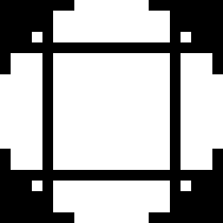
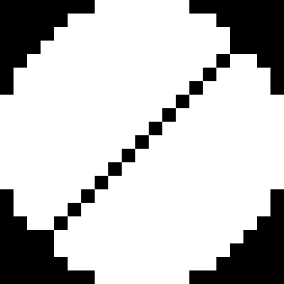
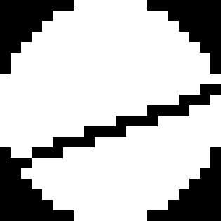

# StringArtGenerator
A tool for generating string art designs from images.

# Stating the Problem
String art is a form of artwork where patterns are created by arranging straight lines (strings) between points to form curves and shapes. This project (for now) targets the special case of unicolor string art on a circular canvas. So first of all we need to convert the image to greyscale and crop it to a circle.

For illustration purposes, we use a simple 21x21 image of a box as an example. We want to put lines on the blank canvas (left)to recreate the box (right).

Generally, this is impossible. The Box is totally disconnected from the border, so whenever we lay a line on there, we are gonna cover some part of the canvas that should be left blank. Best we can do is something like this:

So how are we gonna do that?

# Modeling the Problem
A square grayscale image is just an $N \times N$ matrix with values between 0 and 1. We may model a string as such a matrix with a darkness value $d$ on the line and 0 everywhere else. 
This does come with a handful of problems, though.
Take a look at these images:

They all represent a single string, but the left one adds 15 dark pixels, the middle one 21 and the right one 25. Strings are weighted more or less heavy depending on their orientation, even though in real life they all look the same. To avoid this problem, we normalize each string to have a total darkness of 1. (Choosing the darkness value depending on the distance from the theoretical infinitesimaly thin line may be explored in the future.)

Since the additive group of the $N \times N$ matrices is isomorphic to the $N^2$-dimensional vector space over the same field, we may represent both the image and the strings as a 441-dimensional vector, instead of a 21x21 grid. Note that this includes values outside the cirle. This is not a problem, since those values are 0 anyway, but for performance reasons, we drop those entries and use a $m< N^2$-dimensional vector instead.

Now "adding a string" is as simple as adding the corresponding vector, call it $v_i$. We want something like this:

$$
v_1 \cdot x_1 + v_2 \cdot x_2 + \dots + v_{441} \cdot x_{441} = b
$$

As mentioned above, there may not be an exact solution. So lets state this as a minimization problem in matrix notation:
$$
\min_{x} ||Ax - b||_2
$$

Of course, $x_i$ has to be either 0 or 1 - we cant add half a string and we dont want to use the same string twice - so our otimization alogrithm has to reflect this constraint.

# Solving the Problem
This is a genuinely hard to compute optimization problem. 
For a $N \times N$ image there are about $\pi (N/2)^2$ pixels inside the circle, so $A$ is a $\hat{n} \times \pi (N/2)^2$ matrix where $\hat{n}$ is the number of possible strings.
Lets say there are $n$ nails. Then there are $\binom{n}{2} = \frac{n(n-1)}{2} \approx \frac{n^2}{2}$ possible strings.
Therefore $A$ has $\approx \frac{\pi}{8} n^2 N^2$ entries. 

This gets out of hand quickly. For a moderate $720\times 720$ image and $1000$ nails, this is already about $2 \cdot 10^{11}$ entries or about 200GB of data for a single byte per entry. Unless you have a data center at your disposal or a lot of time to use your harddrive instead of RAM, this is not feasible.

Instead we will use a greedy algorithm, which also has the advantage of making for great animations, as you can see the image being built string by string.

Also its quite easy to implement. We start at $x=0$ and in each step, we add the string $v_i$ that minimizes the error the most. Formally, we solve the following optimization problem in each step:
$$
\min_{i} ||A_{:,i}x + b||_2
$$
where $A_{:,i}$ is the $i$-th column of $A$. This is just math-talk for "we try all possible strings and see which one fits best", though.

